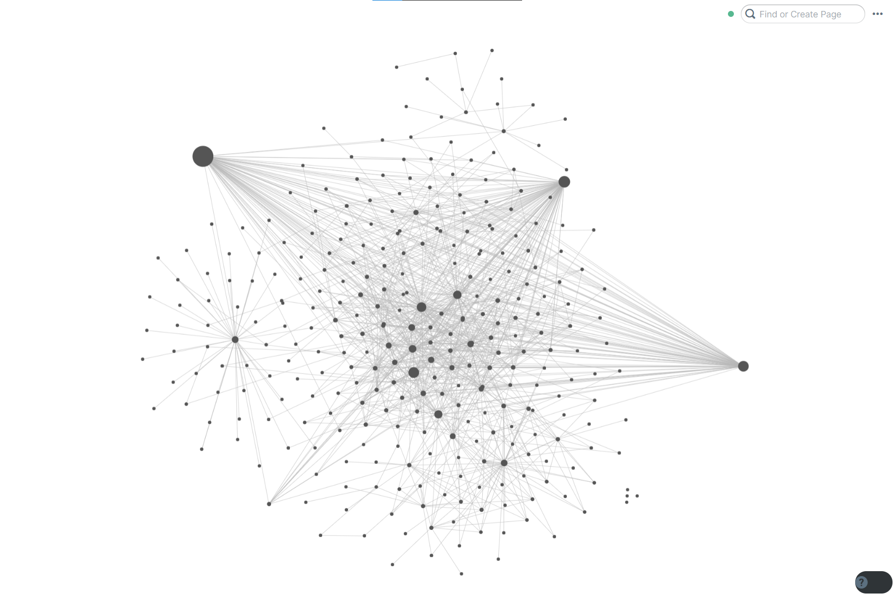

So this article is divided into 5 C(s) which are Create, Consume,
Coordinate, Connect and Cerebrate. Yes, this structure is from Ali Abdaal
but it works well so why not use it.

CREATE

This category contains all the pieces of software that I use in-order to
create stuff. That may be articles, websites, newsletters. So lets get
into it

The first app is the one, the only Roam Research

Roam Research is just such an awesome tool. You can implement the
Resonance Calendar System popularised by Ali Abdaal so efficiently.
the backlink functionality is just amazing. I use it daily and
extensively. if for some reason, I could use Roam Research, I would
have a pretty hard time.

Here is a picture of my graph

Notion

This is the tool that I use for project management. I have a number of
projects going on, and Notion helps me to keep track of everything. I
don&#39;t use it as much as I used to because Roam Research has
replaced many of its functions but still there are so functions of
Notion that I Roam Research does have. It sure is a great app

OneNote

As you know, I love Physics and Maths. I can use Latex and can type
kinda fast but still doing Physics and Maths in Latex is kinda
cumbersome. I am not going to solve whole problems in latex. I
don&#39;t also like using paper, you can end up with piles of paper
which you are not sure whether to discard or keep. So, I use OneNote
and write using the Surface pen.

PyCharm

The main language that I use for programming is Python and in my
opinion, PyCharm is the best Python IDLE.

Visual Studio Code

I have very recently started to learn some app development using
flutter and I use Visual Studio Code as my IDLE of choice for that

Sublime Text

I have hand coded this website in HTML and CSS with a sprinkle of JS.
Sublime text is one of the best IDLE(s) for web development.

The Command Prompt

Fine this is mostly for LOLs. But yes I use the command prompt quite a
lot. I don&#39;t use it that much now, but when I was learning Django,
I used it a lot.

GitHub desktop

This is the app that I use to communicate from my computer to my
GitHub repository. This site is hosted using GitHub pages so it helps
if I can easily change my code and commit changes.

CONSUME

I consume a lot of content such as Books, Audiobooks, Manga, Documentaries
and yes, YouTube videos. Here are the apps that I most often for consuming
content

Audible

Audible is the single best place on earth to get your audiobooks. It
is basically the price for knowledge you pay and it is totally worth
it. I love listening to audiobooks and you can check out my method for
consuming books and audiobooks here.

Reddit

Its the place for me to hangout for like 10 minutes a day. It is a
nice place to ask questions and get answers. It gives you that kind of
community feeling.

Shonen Jump

It is the best platform (at least in that I know of) to get some
manga. it has basically all the manga that you will wish to read.

Google Podcasts

My podcast platform of choice is Google podcasts. It is really simple
and it works well.

Kindle

I like to read and I use the Kindle apps and website to read my books

Play books

I like their upload feature. It is better than the kindle one
otherwise they are pretty similar.

Twitter

The default twitter app is my twitter client

Twitter is under the consume category because I don&#39;t really
Connect much using Twitter

COORDINATE

Day One

It is literally the best journaling app.

The android version is an afterthought for sure but still it is the
best. Just go get it

Microsoft Edge (The new Beta one)

It is the browser of my choice. I use a pretty simple Surface Go with
8 Gigs of RAM and frankly speaking, chrome is too heavy for it.

Google Calender

It is basically the calendar app of choice. I just use it to keep my
routine. It gives me a nice view of my routine. I haven&#39;t really
tried a lot of calendar apps and I find that the Google Calendar app
works fine.

OneDrive

I backup my pictures, documents. It is a grate service and I love
using it. I would have gone for Google Drive but I subscribe to
Microsoft 365 and 1 TB of OneDrive storage is included so I just use
OneDrive.

Power Toys

It is a fun addon for windows. I love using PowerToys run. It is
basically the same as Windows search maybe even a touch worse but it
is just a coolness factor.

I also like to use PowerToys&#39; Fancy zones Feature.

Habitica

A Habit tracker is such a simple app that anyone can build it.
Therefore the stores are flooded with habit trackers. The reason I
prefer Habitica is the community side of things. You can join parties
and go on quests together to defeat bosses.

CONNECT

Gmail

I don&#39;t really care about E-Mail for now because I don&#39;t get
that many. I just Gmail to mange the ones the emails that I receive.

You can E-Mail me at hi@aproductivenerd.com

Whatsapp

Exactly what is sounds like

I use the desktop app because I can type way faster on my PC than on
my phone

CEREBRATE

Anki

Anki is my flashcard app of choice. I use it to memorise random trivia
or facts. Anki is not for understanding, just for memorising. Use it
to memorise random facts not concepts

Duolingo

Duolingo is a free way for you to learn new languages. I am learning
Japanese and I love using Duolingo for that.

Skillshare

Skillshare is a online learning platform with a number of courses
ranging from Productivity to Graphic Design. I have learnt all my
HTML, CSS and JS from there and I love it.
