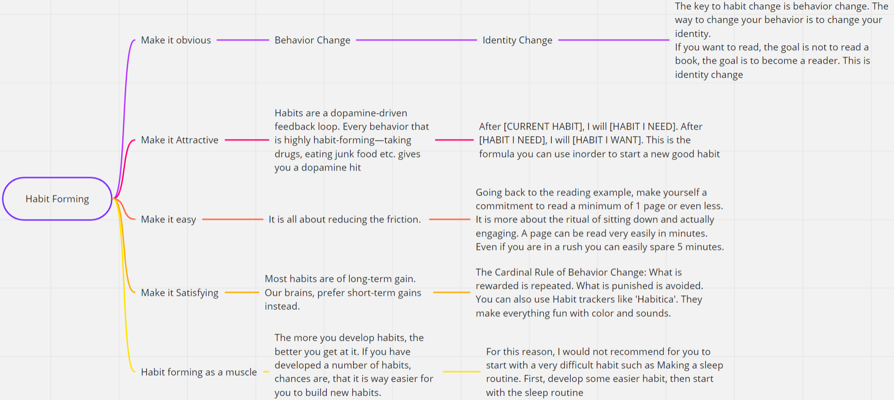

## What is a habit?

- A habit is a routine or behavior that is performed regularly and, in many cases, automatically.
- You don't have to make a conscious effort to perform a habit. It is just what you do. it is done in "AutoPilot mode".
- Here is a simple flowchart that demonstrates the principles of Habit Formation

  

  Please read through this

---

## Steps to develop a reading habit

- [ ] Take a book that you love to read. Don't take something that you have been wanting to read but found too boring or too hard. You may even try out Harry Potter.
- [ ] Then fix a time when you will be reading. Reading at that specific time is the most important task here.
- [ ] After deciding the time and the book, decide the place where you will be reading.
- [ ] Then set two alarms, the first one should be 15 minutes before your reading time and the second one should be at your reading time. The first alarm signals you to stop doing whatever you are doing and helps you to wrap up.
- [ ] After that, sign up for any habit tracker. I would recommend either 'Habitica' or 'Loop Habit Tracker'.
- [ ] Then choose a minimum reading limit. I would recommend you to start with a single page and even reduce it if you want. The commitment of more than 1 page is a bit too much for a minimum amount
- [ ] In your habit tracker, add the habit as "Read at [PLACE] at [TIME] for a minimum of [YOUR MINIMUM LIMIT]"
- [ ] Then, you have to make a streak of at least 18 days. Not missing once and doing it on time.
- [ ] Over time you can increase the minimum limit. If you happen to miss once, that doesn't mean that you have lost the battle. Not down the reason for your failure then immediately move on. Although doing it at the same and at that same place is important they are not as important as the act of reading itself. If the time is up or the place isn't available, please do read.

This checklist can be easily moulded for any habit that you want.

---

If you would like to learn more about Habit Formation, you should check out [Atomic Habits](https://www.amazon.com/Atomic-Habits-Proven-Build-Break/dp/0735211299/ref=sr_1_2?dchild=1&keywords=atomic&qid=1590737523&sr=8-2) by James Clear.

If you face any issues in forming habits or think that I missed something, feel free to comment and inform me. I will make sure to help you out.
