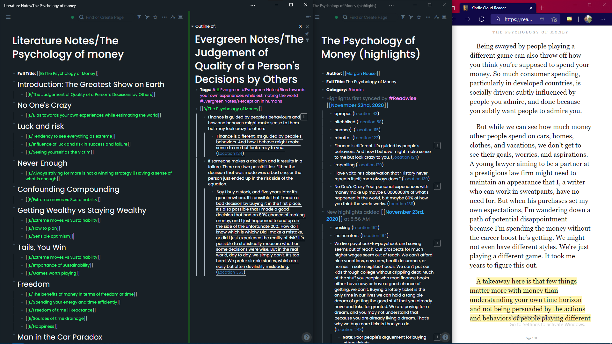
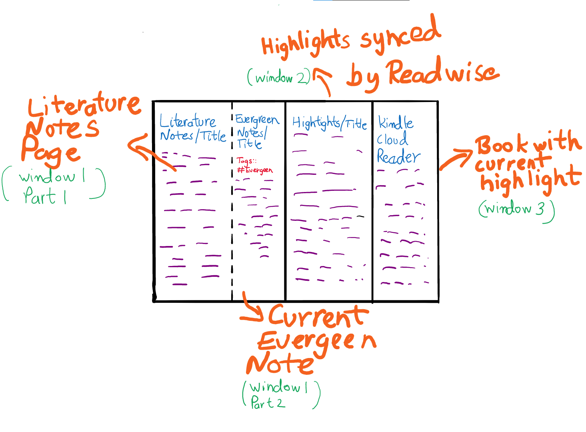

## The tools

For my note-taking toolkit, I use:

1. Kindle

2. Readwise

3. Roam Research

## The reasoning

But now you may ask, why do I spend hours taking detailed notes on books! The answer is simple. It increases the Return On Investment of the time that I put into reading the book. If I just read a book without taking notes on it, I am leaving a lot of potential on the table which is not a good thing. But, if I spend just a little more time taking notes on it, it increases the benefits by a significant margin.

Books contain a wide breadth of information. Take [Book/How to take smart](/pages/content/books/how-to-take-smart-notes/) notes for example. This book has a lot of note-taking related topics but it also has a bit about habit formation and the value of routines! It contains a bit about mindsets and why you should share what you know. If I hadn't taken detailed notes on the book, I would have forgotten these points by now. If I hadn't taken any notes, I would have still remembered at least the surface of what the Zettelkasten method is but I would not be able to give you the philosophy behind it.

Another benefit of taking notes is that you can generate a large number of unexpected connections from them. You probably would have not expected any thing to be common in Book/How to take smart notes and Book/The Psychology of Money, but taking notes allowed me to notice those connections and actually think about them.

One more benefit of taking notes is that you can generate a lot of content from them. As you can probably guess, this article takes a lot of hints from Book/How to take smart notes. Once you have a bunch of connections you can do a lot of creative things with them and come up with new angles on a matter you couldn't even think of before.

## The method to the madness

The first part is gathering the content. This is done on the Kindle. While reading a book, I will highlight a lot of things that resonate with me. With fiction books, I will write a very short account of what has happened in the story till now at the end of a few chapters which (a) helps me remember the story better and engages me in it and (b) it makes it a lot easier for me to later take notes on it to publish.

After I have highlighted things on my kindle, they are synced using Readwise to Roam Research and it is at roam, that the magic starts.

When I have finished reading a book, and the highlights are synced to my roam database, I set up 3 windows like so:

I know there is a lot going on here, so lets go through this window by window.

Here is a quick visual summary of what is going on here, but you should read the details below too

### Window 1

#### Part 1

First of all, lets look at the first window. Each book gets its own `Literature Notes/BOOK NAME` page. I use the `Literature Notes/` syntax to use one of roam's coolest features called namespaces!

Now you may ask about my definition of a "Literature note" because it isn't the conventional definition. Since each book will have several Evergreen Notes(permanent notes) generated from it, I make a single page where I link all of the Evergreen notes that have been created from that particular book. One major benefit of doing it this way stems from the fact that I am not the best at linking notes. Suppose I am writing this article, and I stumble upon Evergreen Notes/Why Zettelkasten?. In each Evergreen Note I mention which book it is taken from. First, I will go through all the other notes that this particular note is linked to, but then I will also go through the titles of the other notes which were created from this book which will at least give me the opportunity to discover unlinked notes that do actually matter to this article.

One positive side effect of using namespaces is also that if I export these notes, all the literature notes come out in their own neat folder!

Now, you may notice the I have the naming syntax of `Evergreen Notes` for each of my Evergreen Notes. And my reasoning for doing so is the same as it is for the literature notes naming syntax.

#### Part 2

Now you may notice that I have the current evergreen note that I am working on open in the sidebar in the first window. There is a lot going on in the sidebar. The first line is filled with tags. The first word there is always an attribute linking to the Tags page using `Tags:`. The first tag will always be the `#🌲Evergreen` tag to make it easier for me to filter them in or out depending on what I need. Then come the main tags which may be links to other Evergreen Notes or other books or any other page in general.

The next line contains the name of the book. In this case it is `Book/The Psychology of Money` which, due to my namespace choice, gets shorted down to `B/The Psychology of Money`. Doing this enables me to clearly see what book these insights are from making it easier to refer a particularly insightful book about the topic I am currently researching. If another book happens to give insights on the same Evergreen Note, I will put their own block beneath the already present book's block.

Indented beneath the book name are the insights that I found out about in the book. I will first read the highlight from [Window 2](#window-2) then see the context of it form [Window 3](#window-3) and then, finally, I will write my thoughts about that highlight. Most of the time, I write the insights in my own words rather than just pasting the highlight there because by writing things in our own words, you can preserve the meaning of the quote in the context of where it was taken from.

You may notice now that I have text indented below even the insight written in my own words. There, I am using another superpower of roam that is.... block references! These things are freaking cool. I reference all the highlights that correspond to a particular insight beneath that insight. These references are taken from the highlights page. Why do I do this? For one, it is so cool and the other reason is that they allow for more interconnectedness in notes and also, it allows me to quote different authors if there choice of words sounds better. It mostly adds a flavor to my notes and my final works.

<h3 id="window-2">Window 2</h3>

Let's move on to the second window now, The second window contains the page created by Readwise in which it has exported the highlights. I have also made a change after taking this screenshot. I have edited Readwise's export settings to using the `Highlights/` syntax for all my highlight pages.

<h3 id="window-3">Window 3</h3>

Now onto the last window. The last window will contain the book I am taking notes on pulled up on the Kindle cloud reader. I don't use the Kindle windows app because it the GUI of that app is really not that good while using in windowed mode. I will have the location of the highlight I am currently taking the note on pulled up on the cloud reader so that I can see the context of what the author was saying.

If you are wondering which Roam Research theme I am using, it is a custom theme made by yours truly. You can check it out by clicking [here](https://github.com/AProductiveNerd/roam-darkness-theme).
