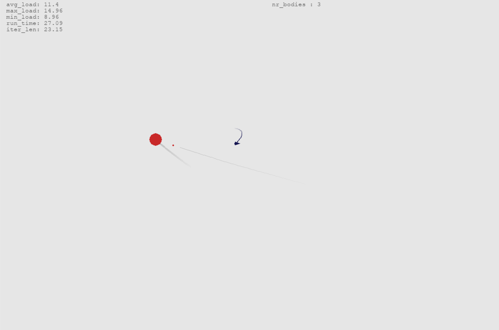
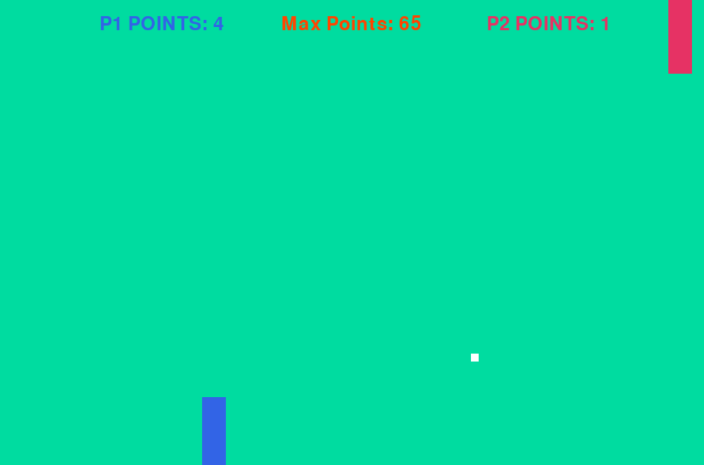
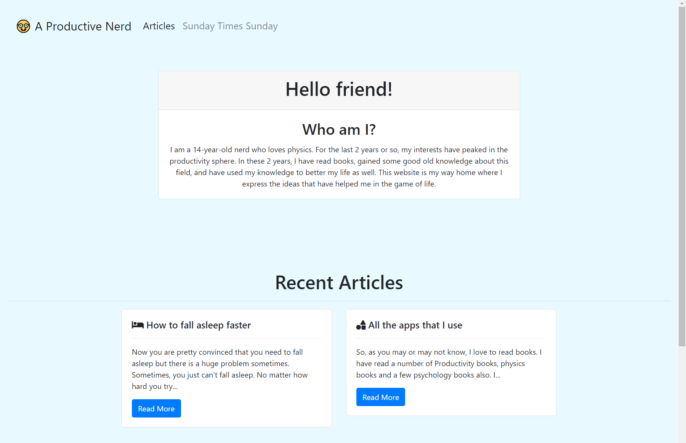

So at this point I think that you can call me a programmer. The main languages that I can code in are Python, HTML and CSS. I mean HTML and CSS aren't really programming languages but I guess you can throw those in too. Some of my creations are..

A to-do List web-app using Django. It makes to do lists. Barely supports user authentication.

A physics n-body simulation turned into a game. The true credit belongs to this reddit post: [I'm working on a 2d N-body simulation using Python and Pygame](https://www.reddit.com/r/Python/comments/hr24b1/im_working_on_a_2d_nbody_simulation_using_python/?utm_medium=android_app&utm_source=share). I just made some improvements and made it into a game

A Pong game using PyGame

A CLI calculator that can solve my Maths homework Not much to show there. It is just numbers

And my most recent and perhaps the most exciting venture...

By the way, the repository on GitHub is public so you can check out all the code if you want to.

Considering these ventures of mine into the programming world, one can safely say that I am at least a beginner level coder.

Now what does it look like when I am coding? Take the website that you are viewing this article on for example. What do you think it looks like when I am coding? The truth is that I am always Googling. Now, I have the hold of the stuff that I already in the website. I am mostly fine with Bootstrap and other things but when it comes to adding things that I don't know about, I am as blank as an average person is. The what is it that differentiates a programmer from an average Joe? It is simply the ability to Google. You need to know how to ask your questions. When I was adding the animated Hamburger menu icon, I had no idea whatsoever on how to do it. I just saw a tutorial on YouTube, some code on Codepen and W3 Schools. Still I couldn't code it. I just made a dummy website with a Navigation bar at the top and a CSS page. I pasted the code from the tutorial into it and then started tweaking to get a gist of how it worked. And now I can animate icons!

The way you can define a programmer best in my opinion is "A person who encounters a problem in programming, knows how to phrase a question about the problem and knows how to interpret and use the answer of that question in order to solve that problem and make the program work". That is what makes a good programmer and to be honest minus the code and programming part, everyone of us can be great at solving problems in our own life if only we just know to ask the write questions and the interpret the answers rightly. This is a skill and like any skill it can be developed overtime, and having a head start in that development process can save you a lot of time. In a future article, I shall explore the different ways to improve your 'ability to Google'. So stick around on that and I will see you in the next one.
