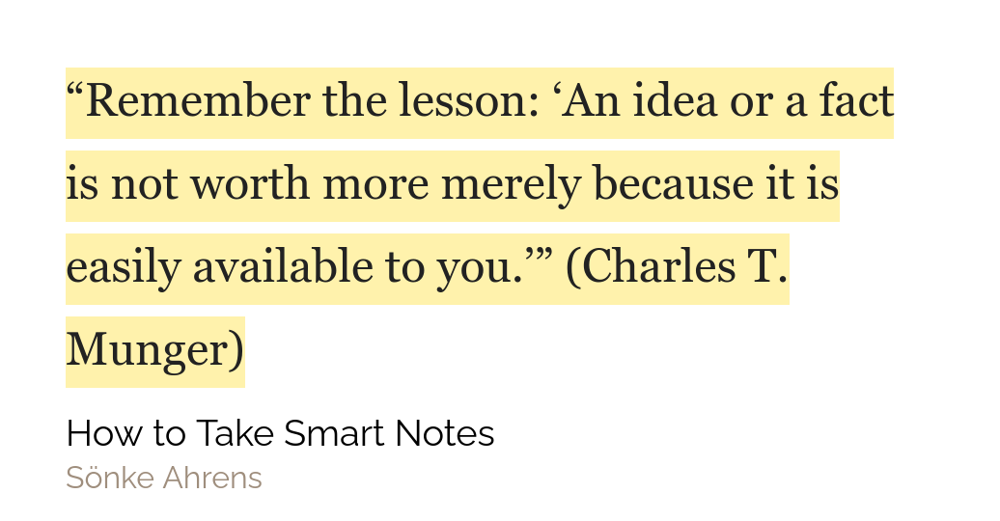

## Reading Review

This week I managed to finish Book: How to take smart notes and Book: Six of crows. And I am about half way through Book: How to Develop Self Confidence and Improve Public speaking, Book: Think Like a Monk, Book: The Obstacle Is the Way.

My detailed notes for Book: How to take smart notes will be available shortly as currently I am in the middle of re-coding my website with exciting features like search!

## Weekly Favourites

**Software** - Readwise. I know this is repetitive and I have been going on and on about readwise for quite a while now but to be honest I just can't stop singing its praise. For the Book: How to take smart notes I made my first ever detailed evergreen notes. I loved the process especially because readwise just painlessly synced my highlights from my kindle to Roam Research. This is world changing because now I can block reference these notes in my Evergreen(Permanent) notes!

**More Software** - I can't just get over software can I? This time it... Roam42. It is a great extension which kinda supercharges Roam Research(as if we Roam needed to be supercharged). But it seriously adds a lot of new functionality to Roam Research primarily because of its focus on keyboard shortcuts. Being a productive nerd, you want to minimize the time between thinking of an action to do on the computer and the action being done. Now, if I want to go to a particular date, I just need to hit Alt-Shift-j and boom I am picking dates!! Do I want to convert a piece of writing(like this newsletter!) to markdown without bullet points? Just hit Alt-m and Roam42 does it all for you.

## Quote of the week

## Tweet of the week

<blockquote className="twitter-tweet" data-dnt="true">
  

    Roam improvement (new feature?)
     
     
    Markdown links now work for aliasing Roam&#39;s internal links
     
     
    so you can point to a particular block - and rather than embed its full
    content - alias it to a variable or footnote number or w/e.
     
     
    syntax is [title you see](((block-uid))) <a href="https://t.co/fsRbi0HUVz">
      pic.twitter.com/fsRbi0HUVz
    </a>
  

  &mdash; Roam Research (@RoamResearch)
  <a href="https://twitter.com/RoamResearch/status/1226707275823206401?ref_src=twsrc%5Etfw">
    February 10, 2020
  </a>
</blockquote>

That was the usual sort of tweet but honestly I couldn't help myself include the following tweets🤣🤣

<blockquote className="twitter-tweet" data-conversation="none" data-dnt="true">
  

    Live scenes from the White House
    <a href="https://t.co/6drVjq0d7A">pic.twitter.com/6drVjq0d7A</a>
  

  &mdash; Sandford Updates (@SandfordUpdates)
  <a href="https://twitter.com/SandfordUpdates/status/1325119672300179458?ref_src=twsrc%5Etfw">
    November 7, 2020
  </a>
</blockquote>

That was the politics season tweet the next one is the manga fan inside me screaming to include this tweet

<blockquote className="twitter-tweet" data-dnt="true">
  

    This is why I love Luffy.
    <a href="https://t.co/HszyfazNVc">pic.twitter.com/HszyfazNVc</a>
  

  &mdash; Totally Not Mark (@TotallyNotMark)
  <a href="https://twitter.com/TotallyNotMark/status/1322920705156124672?ref_src=twsrc%5Etfw">
    November 1, 2020
  </a>
</blockquote>

## Books that I will be finishing this week

