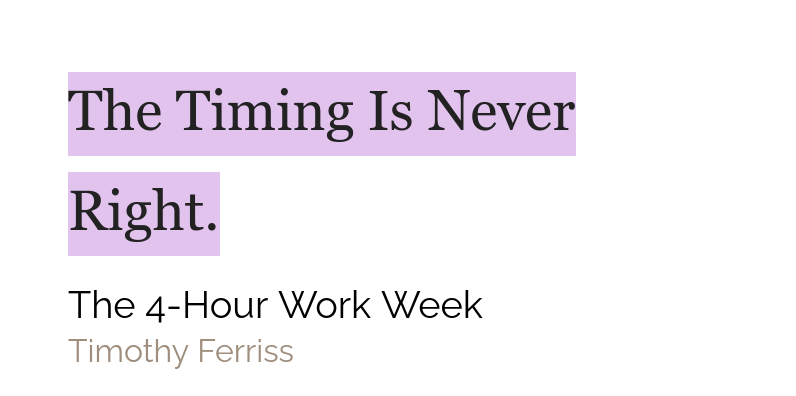

## Prologue

Hello dear reader! As you can probably observe, the look and feel of this site have changed a lot. Now, it also has search functionality built into it. Try it by scrolling till the end of the navigation bar. If you want something similar built for you, contact me!

## Reading Review

This week I finished Book: Think Like a Monk and Book: How to Develop Self Confidence and Improve Public speaking. But... I am not going to lie I didn't enjoy reading Book: Think Like a Monk. Some parts its great but some parts are just really not in my opinion. Would I recommend reading Book: Think Like a Monk? Yes, but with a word of caution that some parts in it are not entirely scientific and should be taken with a grain of salt. Book: How to Develop Self Confidence and Improve Public speaking was a better than average read. It is definitely worth reading but it is not really an interest catcher. I didn't finish Book: The Obstacle Is the Way because I got too hung up on some good old Sherlock Homes.

## Weekly Favourites

**Experience** - Hey this is a new type! The experience which I talk about here is the experience of taking 🌲Evergreen notes. It is simply amazing. When you read through the books material and get the gist of it to take detailed and useful notes, you get a feeling of real learning and a sense of accomplishment. I had this experience while taking 🌲Evergreen and smart notes on the Book: How to take smart notes. Before I knew it, I had written several evergreen notes each of which had some sort of an idea behind it.

**Coffee** - It is no secret that I love coffee. Previously, my horizons were limited to instant coffee but some time ago, I finally made the switch to ground coffee and I am telling you it was worth it! I have been buying all my ground coffee from [Blue Tokai Coffee Roasters](https://bluetokaicoffee.com/) and my favourite so far has been the [Kalledeverapura Pulp Sun Dried](https://bluetokaicoffee.com/collections/coffee/products/kalledeverapura-pulp-sun-dried?variant=1309351560). I know the name is a mouthful but it is a great coffee and at a great price!

## Quote of the week

## Tweet of the week

<blockquote className="twitter-tweet" data-dnt="true">
  

    Every little effort counts in the long run.
    <a href="https://t.co/0Mo82EpWMH">pic.twitter.com/0Mo82EpWMH</a>
  

  &mdash; Tech Burrito (@TechAmazing)
  <a href="https://twitter.com/TechAmazing/status/1327837011395350528?ref_src=twsrc%5Etfw">
    November 15, 2020
  </a>
</blockquote>

## Books that I will be finishing this week

None. I will be focusing on taking notes on the books that I have read and publishing them. This week I guarantee the 🌲Evergreen notes on Book: How to take smart notes and perhaps even the notes on Book: The Four Hour Work Week. The perfectionist inside me, first wants to make a nicer evergreen notes view on the website but if I can't achieve that this week, I will be posting the notes in a rudimentary article format.
