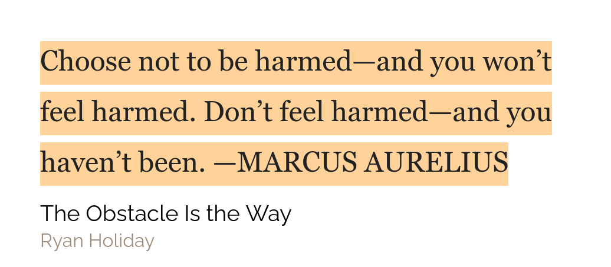

## Reading Review

I know this week I said that I won't be reading, but I ended up reading a lot. I finished [Book/Flipped](https://www.amazon.com/Flipped-Wendelin-Van-Draanen/dp/0375825444/ref=sr_1_2?dchild=1&keywords=Flipped&qid=1606053495&sr=8-2), [Book/Anna and the French Kiss](https://www.amazon.com/Anna-French-Kiss-Stephanie-Perkins/dp/0142419400/ref=sr_1_1?dchild=1&keywords=Anna+and+the+french+kiss&qid=1606053614&sr=8-1), [Book/The Alchemist](https://www.amazon.com/Alchemist-Paulo-Coelho/dp/0062315005/ref=sr_1_1?dchild=1&keywords=The+Alchemist&qid=1606053482&sr=8-1) and [Book/The Obstacle Is the Way](https://www.amazon.com/Obstacle-Way-Ancient-Adversity-Advantage/dp/1781251495). My notes for [Book/Flipped](https://www.amazon.com/Flipped-Wendelin-Van-Draanen/dp/0375825444/ref=sr_1_2?dchild=1&keywords=Flipped&qid=1606053495&sr=8-2) and available [here](../books/flipped.mdx). Also, my notes for Book/How to take smart notes are available [here](../books/how-to-take-smart-notes.mdx).

## Weekly favourites

**A fiction book** - '[The Alchemist](https://www.amazon.com/Alchemist-Paulo-Coelho/dp/0062315005/ref=sr_1_1?dchild=1&keywords=The+Alchemist&qid=1606053482&sr=8-1)' is the book that I am going to talk about here. The book just has this cool theme to it with omens and stuff. My personal favourite part of the book will be when The Alchemist finally meets that boy in the oasis camp.

**Another book** - I never imagined that I would like this book but I seriously loved it! The book's name is Book/Flipped and it is a Teen Romantic Novel and it is fun. You can see my summary [here](../books/flipped.mdx).

## Quote of the week

## Tweet of the week

<blockquote class="twitter-tweet" data-dnt="true">
  

    If you think every day, write every day.
  

  &mdash; Jack Butcher (@jackbutcher) <a href="https://twitter.com/jackbutcher/status/1328318760449691648?ref_src=twsrc%5Etfw">November 16, 2020</a>
</blockquote>

## Books that I will be finishing this week

