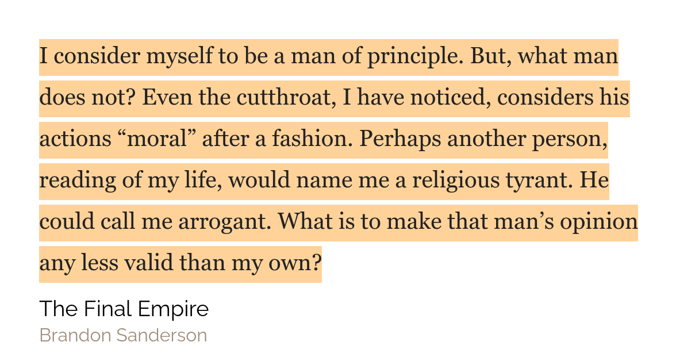

## Reading review

Where do I begin. This week I decided to get into the _Mistborn_ series by Brandon Sanderson. I wouldn't say that I have read a great number of book but of the books that I have read, by far, Book/Mistborn/The Final Empire is the best book. The characters feel alive and so does the story! There is foreshadowing of upcoming events like hinting at the abilities of the big baddy which gives you immense satisfaction if you manage to catch that line of thought. Now, the second book which I decided to read was Book/The Psychology of Money and it is also a great book! It talks about some things that I have been thinking about a lot lately like the fact that seemingly poor decisions made by people are actually very reasonable to them in the moment. And the roles of luck and risk inside people's financial outcomes and outcomes in life in general. The author talks about how there is always luck and risk involved in every decision. If the decision but the person just happens to be on the wrong side of probability, then that seemingly good decision can ruin his life. And very poor financial decisions can turn people into billionaires just by a stroke of luck. So when we are trying to learning from people, we should not look at individual case studies but rather we should notice trends. My in depth notes will be coming soon.

## Weekly favourites

**An activity** - The activity that I am talking about today is Journaling. I have been journaling pretty much every day since the 30th of March. I have had quite a few downs in this journey, especially because I am often sickly. But for the most part I have journaled at least over 200 words over these days. My average nowadays is about 300 to 400 words in my evening journal everyday although I have written quite a few of 1000 words journals as well. I mention journaling write now because this week I decided to read my journals. Apart from the nostalgia, I have experienced quite a few other practical benefits as well.

## Quote of the week

## Tweet of the week

<blockquote class="twitter-tweet" data-dnt="true">
  

    Yesterday
    <a href="https://twitter.com/RoamResearch?ref_src=twsrc%5Etfw">
      @RoamResearch
    </a>
    showed us the very useful new path based find or create tool. Their site is
    updated with a brief summary of the feature.
    <a href="https://twitter.com/hashtag/roamcult?src=hash&amp;ref_src=twsrc%5Etfw">
      #roamcult
    </a>
     
     
    Commit these to muscle memory :-)
    <a href="https://t.co/byDiJMux2S">pic.twitter.com/byDiJMux2S</a>
  

  &mdash; RoamHacker 👨‍🔧 ((roam42.com)) (@roamhacker)
  <a href="https://twitter.com/roamhacker/status/1330588873412538372?ref_src=twsrc%5Etfw">
    November 22, 2020
  </a>
</blockquote>

## Books that I will be finishing this week

I have consumed a number of non-fiction books over the months but I haven't taken notes on many of them. So this week I intend to not read new content but rather re-read old books and take notes on them. So with this in mind I will be reading Book/Atomic Habits

