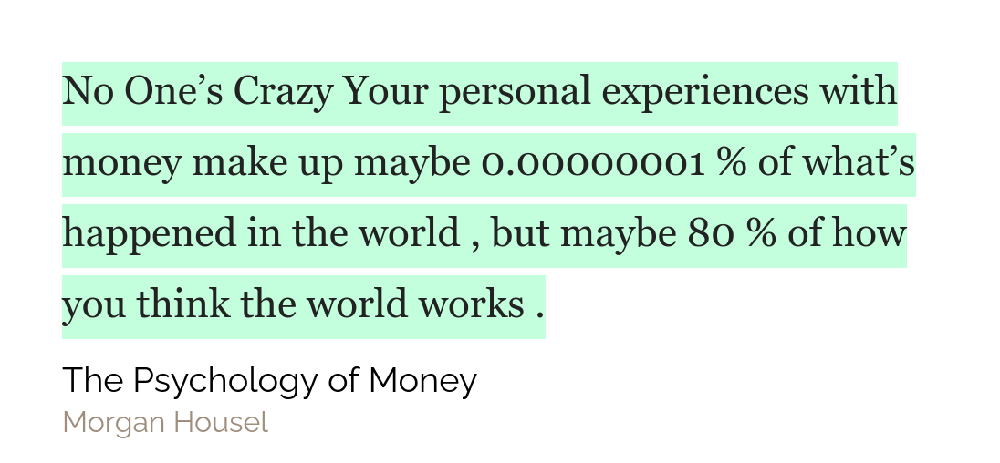

## Weekly favourites

**Software** - This week's favourite software is...[Ueli](https://ueli.app/#/)! I have been searching for an app like this for ages and I have finally found it!! Ueli helps you to quickly launch an app or google something or convert currencies. You can make shortcuts for websites like Gmail and you can also have it execute scripts! I know the in Windows you can just use the native Windows Search and it works great but one of the major disadvantages of it is that it uses Bing. So yeah, not cool.

## Quote of the week

## Tweet of the week

<blockquote class="twitter-tweet" data-dnt="true">
  

    How to do a simple search and replace in
    <a href="https://twitter.com/hashtag/Roam?src=hash&amp;ref_src=twsrc%5Etfw">
      #Roam
    </a>
    :).
    <a href="https://twitter.com/hashtag/roamcult?src=hash&amp;ref_src=twsrc%5Etfw">
      #roamcult
    </a>
    Select the text, convert it into a page, change the page title and delete
    the page. <a href="https://t.co/u1NO3a8ljO">pic.twitter.com/u1NO3a8ljO</a>
  

  &mdash; CatoMinor (@CatoMinor3)
  <a href="https://twitter.com/CatoMinor3/status/1335509543535652865?ref_src=twsrc%5Etfw">
    December 6, 2020
  </a>
</blockquote>

## Books that I will be finishing this week

Sadly this week I was not able to read a book nor was I able to take some notes. So this week's reading is the same as last week. I will be reading Book/Atomic Habits and I will be publishing my notes on Book/The Psychology of Money

