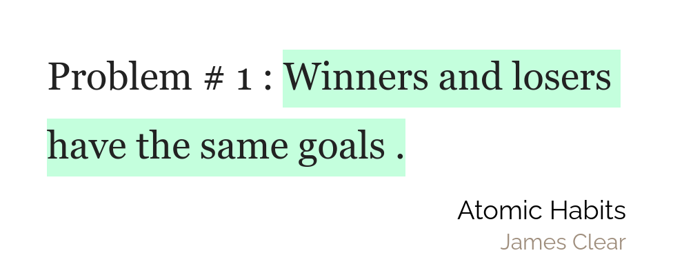

## Announcement

This very site, that you are viewing is now a PWA and can work offline. The offline part still has a lot of room to improve but I would love if you were to check it out and give me some suggestions. You can see the contact links in the footer down below.

## Weekly favourites

**Instapaper** - Instapaper is essentially a save to read-later app. The main reason I have started using Instapaper for is to take notes on articles. Instapaper has a very similar integration with Readwise as the Kindle does. So, I can use my [note taking workflow](/pages/content/articles/my-note-taking-workflow/) to extract the juicy knowledge from articles and websites

**Julian Shapiro** - [Julian Shapiro](https://www.julian.com/)'s website consists of "handbooks of knowledge". All of them are free and they touch on different topics from writing to muscle building. I have been deeply interested in the writing part and I hope that in the coming articles my writing improves

## Quote of the week

## Tweet of the week

<blockquote className="twitter-tweet" data-dnt="true">
  

    Tip for creators🧐
     
     
    Whenever you don’t feel like publishing your work because you think it’s not
    “original” or someone else already made something similar, remind yourself there
    are &gt;1000 biographies of Winston Churchill  
     
    Publish it anyways!
  

  &mdash; Shu Omi (@shuomi3) <a href="https://twitter.com/shuomi3/status/1352943755104448512?ref_src=twsrc%5Etfw">
    January 23, 2021
  </a>
</blockquote>

## Books that I will be reading this week

## Articles coming up this week

Articles/How I boost my productivity on a computer

Everyone uses a computer. During the lockdown, even strictly analog institutes like schools and government offices have had to go to a computer. This has lead a new surge of people who had never touched computers in their lives to have no choice but to use them...
