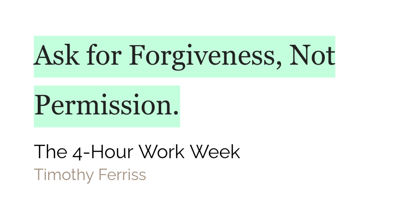
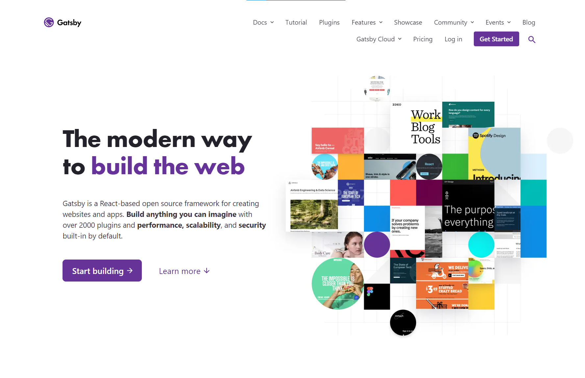
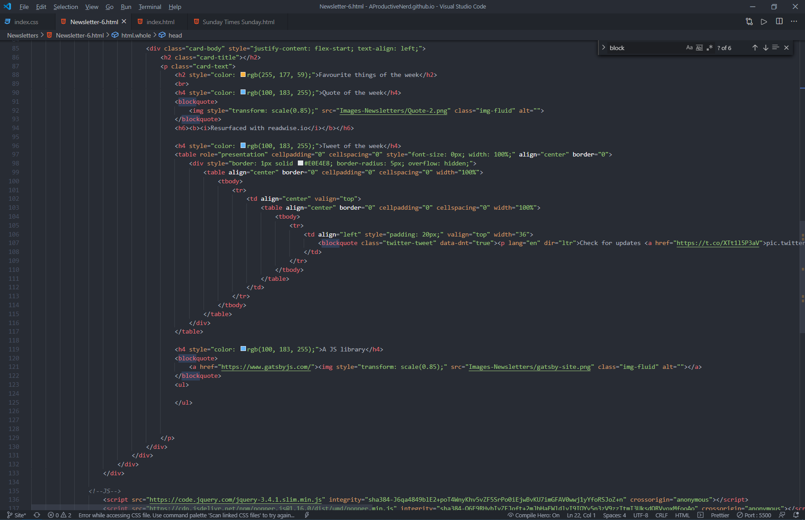
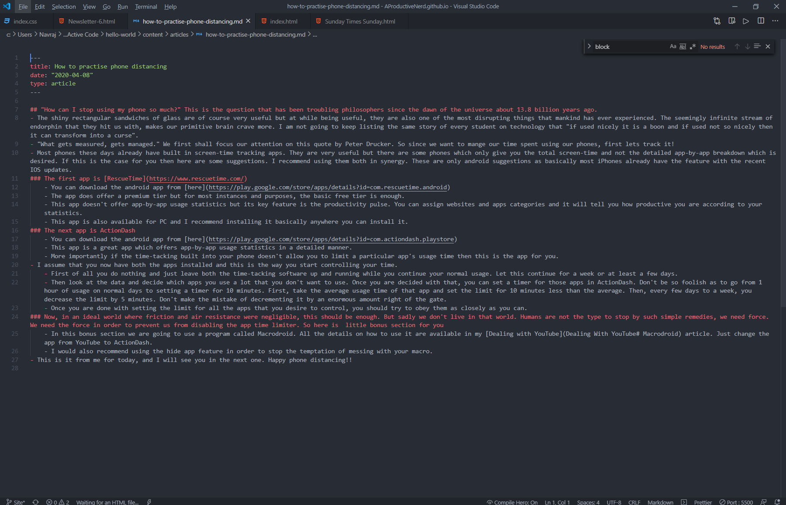

# Favourite things of the week

#### Quote of the week

##### **_Resurfaced with [readwise.io](https://readwise.io/)_**

#### Tweet of the week

<blockquote className="twitter-tweet" data-dnt="true">
  

    Check for updates
    <a href="https://t.co/XTt1l5P3aV">pic.twitter.com/XTt1l5P3aV</a>
  

  &mdash; Conor White-Sullivan (@Conaw)
  <a href="https://twitter.com/Conaw/status/1309184269361639429?ref_src=twsrc%5Etfw">
    September 24, 2020
  </a>
</blockquote>

#### A JS library

Gatsby is amazing!!

In order to explain why Gatsby is so amazing let me explain the differences
between my experience without Gatsby and with Gatsby

Just see this! This is what I have to do when I have to publish something

This is me converting my markdown document to HTML. Yup! That is pretty
tedious

Then I have to take out 30 words from this using
[Wordcounter.net](https://wordcounter.net/)

Then we I have to paste those 30 words in a card template thing.
Then I have to take that filled in template and paste it in 2 places.
That was without Gatsby. Now how does Gatsby help me?
I just paste my markdown in to a markdown file like this

After pasting it I fill in the stuff at the top and it all auto populates I don't
need to do anything more!!

At this point you should see how and why is Gatsby just such a helpful tool

## PostScript

I have still not totally moved on to Gatsby but will probably do so in this
week
