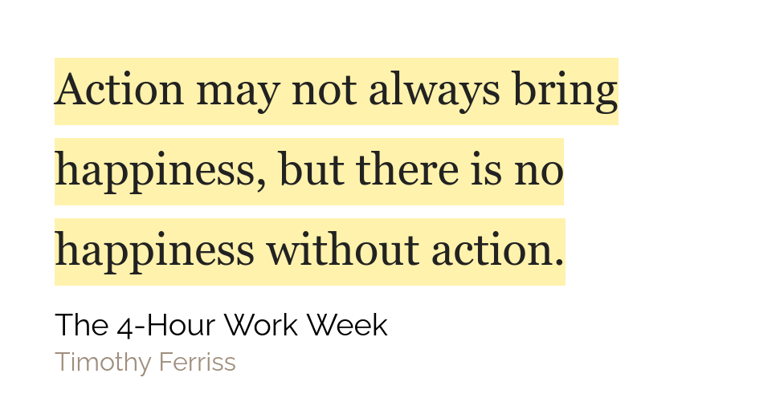

## Apology

First of all I would like to apologise for not posting this week's article and the previous week's newsletter but I was too much engrossed into this site and coding and I couldn't make time for writing, This site is finally on Gatsby!! Now I am taking a break from all things coding. I will still be writing articles but there probably won't be any new features on this site. The next addition to this site will probably be a search bar which searches through the names of all the articles. This week's articles will be on books and how reading helps me live happier and smarter. Now that this is out of the way, lets get into the content

## Weekly favourites

**Software** - Visual Studio Code. I have been coding for some time now and I was
starting to be a Sublime Text fanboy. I still used VS Code but it wasn't doing the
job for me. But now.. things have changed. I don't even use Sublime Text anymore
and now I use VS Code. I am mainly a ReactJS guy and this website is built using
GatsbyJS which is powered by ReactJS and the experience of coding React in VS Code
is leaps and bounds ahead than that of Sublime.

**More Software** - So as you know from my quote of weeks, I use Readwise.io. I used to like it for sure but I wasn't blown away as I thought I would be. But now it actually has blown my mind. I new that you could do exports from Readwise to Roam Research, Evernote and Notion, but I didn't think that this will be so revolutionary. I thought that Readwise would just copy my highlights from my Kindle account and paste it into my Roam database. But oh boy was I wrong. And I am glad to be wrong. Let me explain how it pleasantly surprised me. Readwise, sends you your highlights from books, and articles(and now even podcasts! at least if you are on IOS). You can tag them as your favourite, or make custom tags. When you sync your highlights to Roam, it creates a page in Roam with the name of the book concatenated with '(highlights)'. In this page it copies and pastes your highlights along with their locations in the book. So if you click on the location it automatically jumps to that place in the book. Now here is the cool part. It nests your tags in side your highlights. Here, see this

Ask for Forgiveness, Not Permission is my highlight and it has its location right
beside it as a link. And nested inside are the tags associated with it through the
Readwise App!!

## Quote of the week

## Tweet of the week

<blockquote className="twitter-tweet" data-dnt="true">
  

    π <a href="https://t.co/HjQ05PqSDa">pic.twitter.com/HjQ05PqSDa</a>
  

  &mdash; Grant Sanderson (@3blue1brown) <a href="https://twitter.com/3blue1brown/status/1315022219307749376?ref_src=twsrc%5Etfw">October 10, 2020</a>
</blockquote>

## Books that I will be finishing this week

  

  

  

