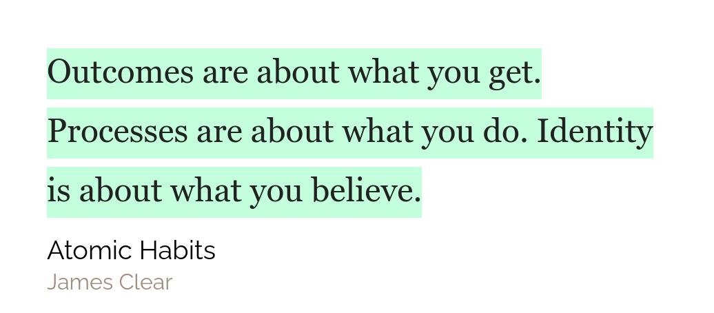
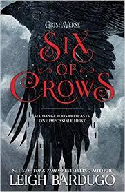
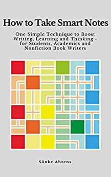

## Reading Review

This week I managed to finish The Four Hour Work Week. I strted The Case Against Education, but, to my dismay, the book didn't arouse my curiosity as much as I had hoped it would. I still read most of it(probably because of the [Confirmation-bias](https://en.wikipedia.org/wiki/Confirmation_bias)). My highlights from The Four Hour Work Week are also public so you can find them [here](/pages/content/books/the-four-hour-work-week). I will also be publishing my notes once they are complete.

## Weekly Favourites

**Software** - A Visual Studio Code font and its accompanying theme. The theme is [codeSTACKr](https://marketplace.visualstudio.com/items?itemName=codestackr.codestackr-theme) theme. Honestly the theme is not that special. I really like it but there are other similar alternatives out there. The thing that makes it unique and the right fit for me is its selection of what to italicize. This is where my next part of this comes in. The [Victor Mono](https://rubjo.github.io/victor-mono/) font. This font is awesome mainly for it's italic text and I love it.

**An idea** - I told last time that I was a big fan of [[Dr. Shashi Tharoor]] and if you are his fan, you ought to be fan of English. So I have made my own [[💬 Thesaurus]]. In it, I keep the words that I want to **use** more often and the words which are new to me.

## Quote of the week

## Tweet of the week

<blockquote className="twitter-tweet" data-dnt="true">
  

    <a href="https://twitter.com/hashtag/roamcult?src=hash&amp;ref_src=twsrc%5Etfw">
      #roamcult
    </a>
    #favourite #favourite
    <a href="https://twitter.com/Conaw?ref_src=twsrc%5Etfw">@Conaw</a>
    #favourite
    <a href="https://twitter.com/RoamResearch?ref_src=twsrc%5Etfw">
      @RoamResearch
    </a>
    #favourite #favourite
    <a href="https://twitter.com/roamhacker?ref_src=twsrc%5Etfw">@roamhacker</a>
    #favourite BIG updates to my Attribute Table filtering script. Group logic, date
    ranges, saving filters, aggregates (SUM, MIN, MAX, AVG). Install like any other
    roam/js script. #favourite
    <a href="https://t.co/mFWiujQH6f">https://t.co/mFWiujQH6f</a> #favourite
    <a href="https://t.co/QZCUTExPbJ">pic.twitter.com/QZCUTExPbJ</a>
  

  &mdash; Shawn Murphy (@shawnpmurphy8) <a href="https://twitter.com/shawnpmurphy8/status/1316770461624090625?ref_src=twsrc%5Etfw">October 15, 2020</a>
</blockquote>

## Books that I will be finishing this week

