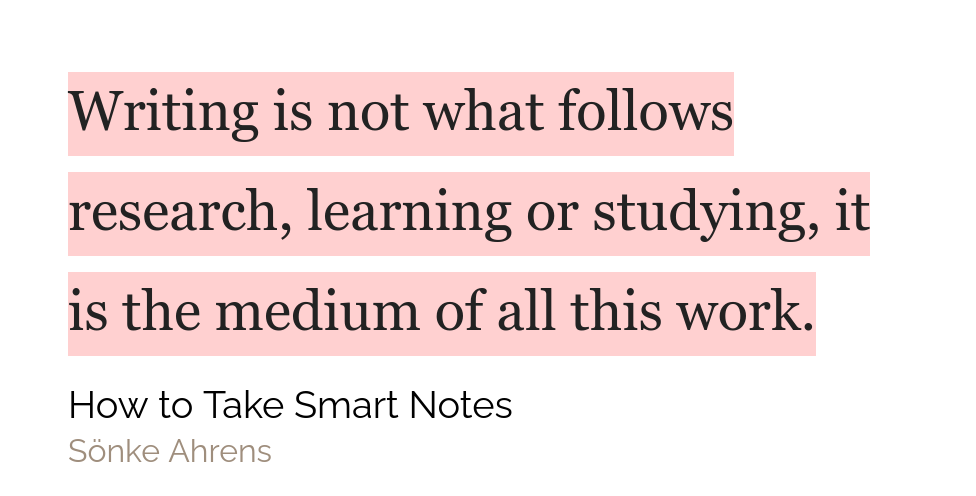

I have been out of town for some time. That is why there were no posts this entire week. But in that off-time, I have made a big plan for this website so look out for any changes and stay tuned.

## Weekly favourites

**Hardware** - The Kindle paperwhite is the highlight for me. It may come as a surprise to you that such a reading lover like me didn't have a kindle but it is the truth. It is only this week the I got my kindle paperwhite and not gonna lie, I really love it. I don't like reading on my phone. I can read on my Surface Go 2018 but it is too heavy to be comfortable. So I only read at my desk on my monitor. But now I am at the liberty to read wherever I want to read!

**Two Roam Research Themes** - I love Roam Research. So naturally I want to customise the hell out of it. The first theme helps me to do just that. It is called '[Roam Dark Age](https://github.com/shodty/Roam_Dark_Age)'. I have made some minor customisations of my own to this theme to give tags a background and also give a splash of colour to page references. There are also some themes which not only customise Roam, but they also add somewhat new functionality to it. Roam Dark Age also does it to some extent but the one which I am going to talk about here is...[A Gruvbox Theme for Roam Research](https://www.cortexfutura.com/blog/gruvbox-theme/) by the one and only [Cortex Futura](https://www.cortexfutura.com/)! It adds a new angle the Roam Research. I particularly find it helpful when taking notes on books.

# Quote of the week

## Tweet of the week

<blockquote className="twitter-tweet" data-dnt="true">
  

    1/5 Roam42 Update - New Beta Features
     
    We just rolled out to Roam42 users two new beta features making it a little
    easier to get your data out of Roam.
     + Format Converter
     + Web View
     
     
    Please give it a try, DM me bug reports or join us at <a href="https://twitter.com/hashtag/roam42?src=hash&amp;ref_src=twsrc%5Etfw">
      #roam42
    </a> on slack.<a href="https://twitter.com/hashtag/roamcult?src=hash&amp;ref_src=twsrc%5Etfw">
      #roamcult
    </a> <a href="https://twitter.com/RoamResearch?ref_src=twsrc%5Etfw">
      @RoamResearch
    </a> <a href="https://t.co/pcTCWLK5R1">pic.twitter.com/pcTCWLK5R1</a>
  

  &mdash; RoamHacker 👨‍🔧 ((roam42.com)) (@roamhacker)
  <a href="https://twitter.com/roamhacker/status/1321927815051313158?ref_src=twsrc%5Etfw">
    October 29, 2020
  </a>
</blockquote>

## Books that I will be finishing this week

Since I couldn't read this week the books will be the same as the last time

